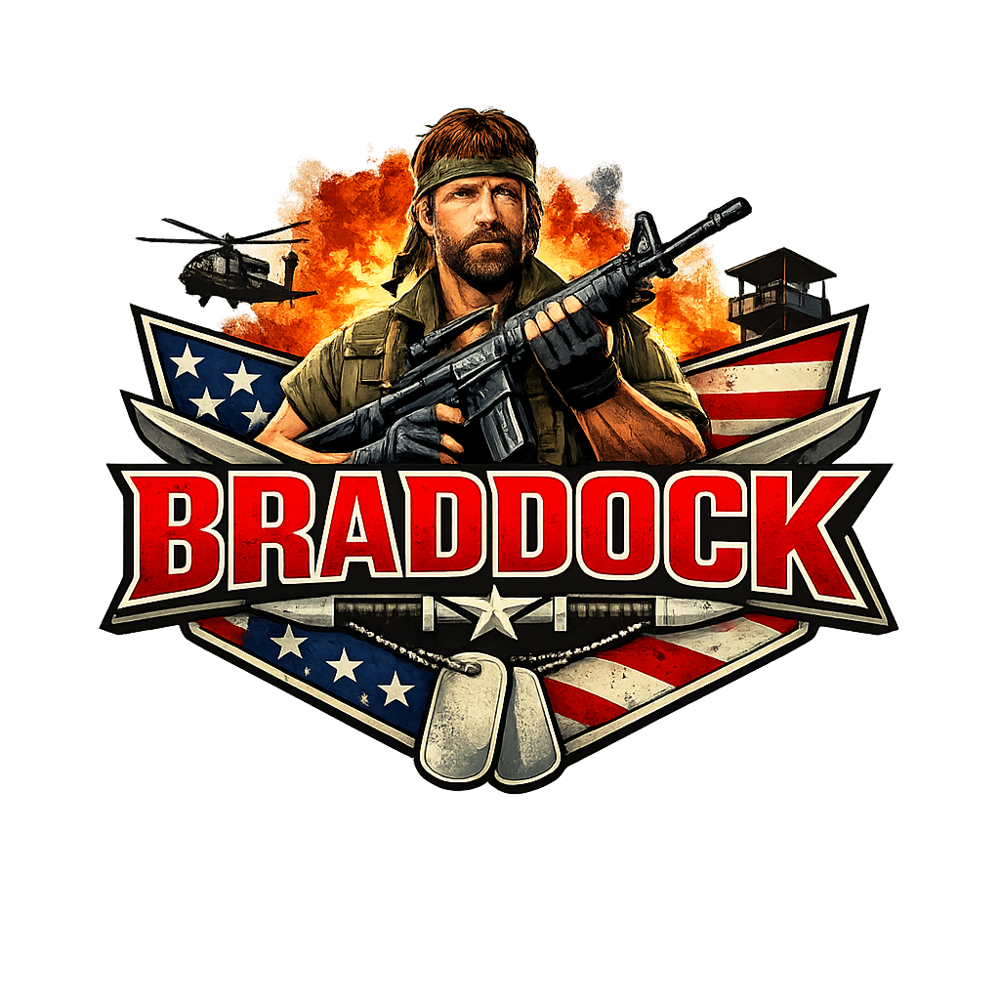

<center>

</center>

## What is this?

Remember Colonel James Braddock? The guy who walked into a hostile jungle alone — no written plan, no kickoff meeting, no slide deck — and came out with everything solved?

Let's be honest: there's no other Braddock in the world, and there never will be. So here's a complete squad instead: defined roles, traceable artifacts, iron-clad governance, and a Kanban JSON that doesn't lie to anyone.

> Braddock doesn't ask for a PRD. But you need one.

## Agents

Like any special operation worth its name, every mission requires specialists:

| Agent                  | Role                              |
| ---------------------- | --------------------------------- |
| `pm`                   | Transforms vision into PRD        |
| `tech-lead`            | Architecture, trade-offs, risks   |
| `architect-specialist` | Structure, modules, boundaries    |
| `backend-senior`       | Implements business rules         |
| `frontend-senior`      | Interface, flows, integration     |
| `ui-ux`                | Experience, clarity, conversion   |
| `planner`              | Breaks work into epics and tasks  |
| `qa`                   | Validates, flags gaps, reviews    |

> _Braddock went in alone to solve the problem. You have an entire squad. Use it._

---

## Pipeline

No mission starts in the middle. Neither does this one:

```
Vision → PRD → Architecture → Spec → Tasks → Implementation → Review
```

Each step produces an artifact. Each artifact feeds the next step.

---

## Skills

| Skill              | What it does                                        |
| ------------------ | --------------------------------------------------- |
| `/kickoff`         | Initializes the operation, prepares the ground      |
| `/create-prd`      | PM defines the mission objective                    |
| `/create-spec`     | Tech Lead + Architect + UI/UX build the plan        |
| `/breakdown-work`  | Planner breaks into epics, stories, and small bets  |
| `/implement-task`  | Executes the next eligible task                     |
| `/review-delivery` | QA + Tech Lead validate what was delivered          |

## Structure

```
your-project/
├─ .braddock/
│  ├─ PROMPT.md             # The kickoff prompt. Paste into Claude Code.
│  ├─ board/
│  │  └─ kanban.json        # The tactical map. Always up to date.
│  └─ memory/
│     ├─ vision.md          # Why the mission exists
│     ├─ prd.md             # What needs to be done
│     ├─ architecture.md    # How it will be done
│     ├─ spec.md            # The technical contract
│     ├─ tasks.json         # What each agent will do
│     ├─ decisions.md       # Decisions that cannot be forgotten
│     └─ status.md          # Where we are right now
└─ .claude/
   ├─ CLAUDE.md             # The law. Non-negotiable.
   ├─ settings.json         # Minimal config. Braddock would approve.
   ├─ agents/               # The squad. One file per role.
   └─ skills/               # The moves. One skill per pipeline step.
```

---

## Code of honor

1. Always read `.braddock/memory/` before taking any action.
2. Never implement before a PRD and spec exist.
3. Never assume a business rule without recording a decision.
4. Maintain traceability: vision → PRD → spec → task → code.
5. Before closing any step: validate consistency, flag risks, flag dependencies.

## Getting started

<image src="./assets/images/help.png" />

### 1. Install Braddock in your project

```bash
# Install in the current directory
npx braddock init

# Install in a specific directory
npx braddock init /path/to/your/project
```

> Does not overwrite files that already exist in the target project.

### 2. Define your product vision

Edit `.braddock/memory/vision.md` with your product idea. Without this, the squad has no mission.

### 3. Fire up the squad in Claude Code

Paste the content of `PROMPT.md` into Claude Code:

```
You are operating inside a virtual squad system called Braddock.

Read first, in this order:
- .claude/CLAUDE.md
- ./braddock/memory/vision.md
- ./braddock/memory/status.md

Your mission is to initialize the project and prepare the squad for execution.

Rules that cannot be broken:
- Never skip steps in the pipeline
- Never implement code before an approved PRD and spec exist
- Never assume a business rule without recording it in ./braddock/memory/decisions.md
- Always maintain traceability: vision → PRD → spec → task → code

Default pipeline:
/kickoff → /create-prd → /create-spec → /breakdown-work → /implement-task → /review-delivery

Start now with /kickoff.
```

From there, each skill points to the next one when it finishes. The squad is self-guided.

## The most important thing

What makes this actually work isn't having several agents with fancy names.

It's this:

- **Strong governance** — nobody acts outside their role
- **Fixed pipeline** — no shortcuts, no improvising
- **Persisted artifacts** — what was decided, stays recorded
- **Full traceability** — vision connects to PRD connects to code

Without that, it's just a bunch of AI agents yelling in the jungle.

Braddock yelled. The squad documents.

> _Mission started. Waiting for `/kickoff`._
